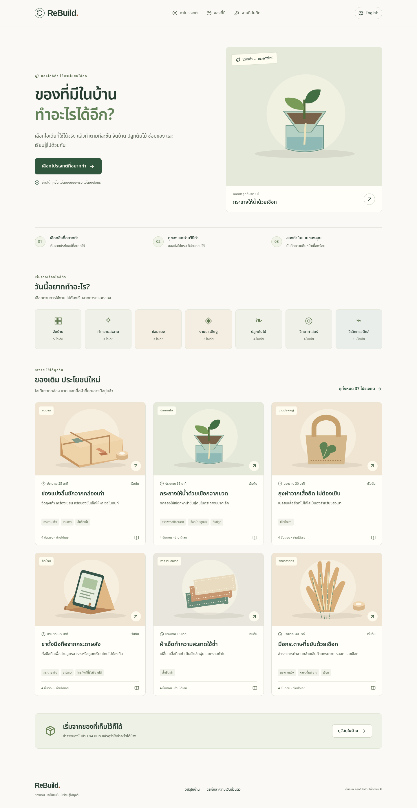
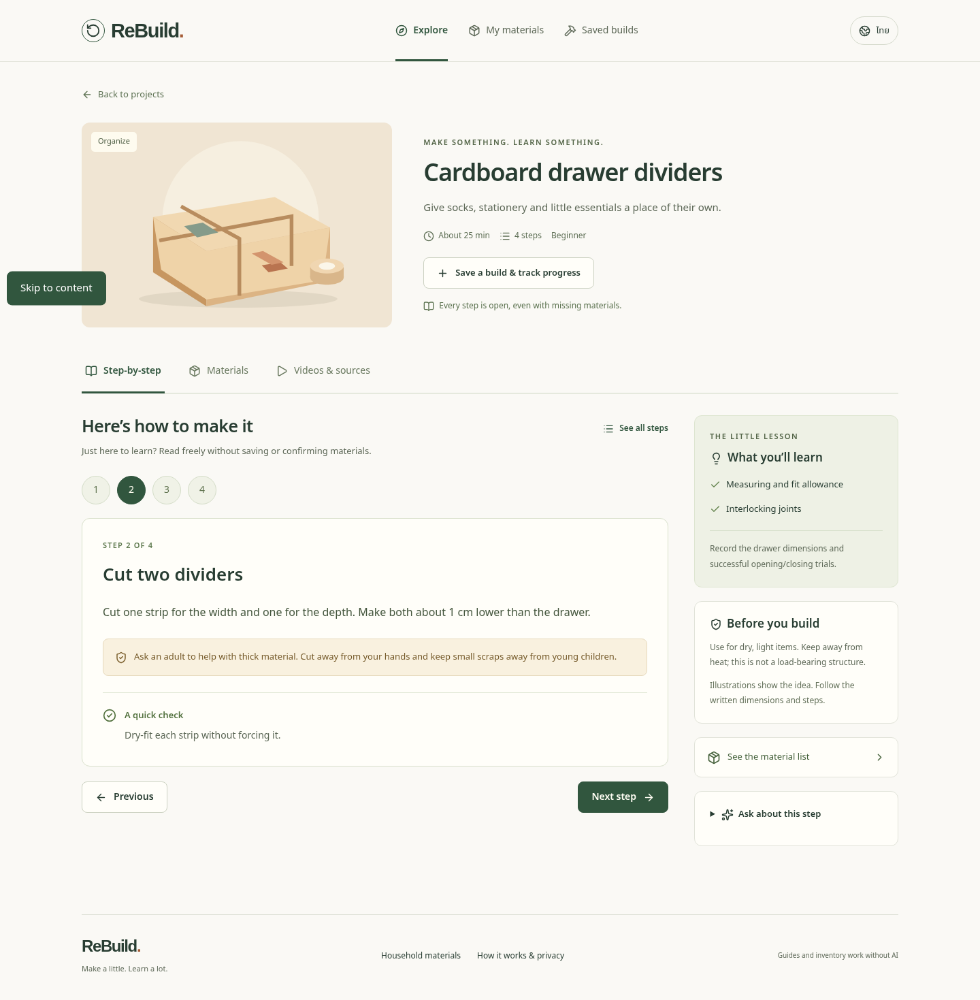

# Household-first redesign

Users can now choose something useful to make before recording inventory. The initial screen points to practical projects, and an empty or uncertain inventory never disables reading or progress tracking.

- Three main destinations: Explore, My materials, Saved builds. A Thai/English switch persists across refresh.
- 37 guides and 94 material types. The 21 new household guides cover drawer dividers, a desk caddy, cable storage, labelled jars, a phone stand, cleaning cloths, a dusting mitt, a lint roller, button sewing, fabric patching, a zipper pull, a no-sew tote, gift packaging, a woven coaster, a wick planter, seed pots, propagation, plant labels, a marble maze, a moving hand and a paper bridge.
- Original large illustrations, purpose-led cards and project/material search. Results appear 12 at a time; category selection narrows them.
- Guides open on the steps. Next/Previous never depends on inventory readiness. Materials, alternatives and tutorial links are separate sections. Saved builds retain notes, measurements and substitution records.
- Manual Save replaces the separate verification checkbox. Unknown details are still unknown; AI/bulk suggestions stay unchecked until reviewed. Custom items remain available when the catalogue does not match.
- Version 1 material IDs, original step ordering, backup format and existing saved data remain compatible.

Household content is authored for this app and not physically validated. Tutorial searches are clearly searches. The only direct video in this release is the NASA link observed in its written rocket guide; no playback or transcript review is claimed.

The update uses the existing Node build/start commands and does not require new packages, database migration, a hosting-plan upgrade or a plugin. Render can deploy the updated GitHub branch through its existing deployment settings. Check the deployment status and public URL separately.

